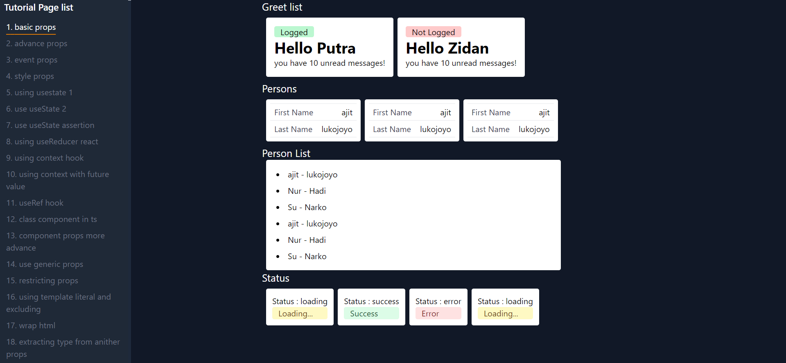

# React Typescript Learning repo
This project was bootstrapped with [Create React App](https://github.com/facebook/create-react-app).

My repo for storing my learning activity of react with typescript. however, because it is my firsr project documentation i wrote in english, maybe you will find many error grammar.

## Published Site
https://react-typescript-nu.vercel.app/

## Available Scripts

In the project directory, you can run:

### `npm start`
### `npm test`
### `npm run build`
### `npm run eject`
## Learn More

You can learn more in the [Create React App documentation](https://facebook.github.io/create-react-app/docs/getting-started).

To learn React, check out the [React documentation](https://reactjs.org/).
